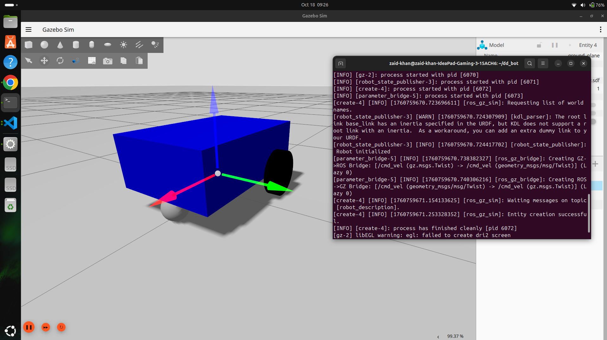

## Differential Drive Robot Simulation using ROS2 Jazzy & Gazebo Harmonic

This repository contains a simple Differential Drive Robot simulation developed using ROS2 Jazzy Jalisco and Gazebo Harmonic.

The project demonstrates the implementation of a mobile robot using:
- URDF/Xacro robot modeling
- Gazebo simulation
- Differential drive motion control
- ROS2 topic communication
- Gazebo plugins

The robot can move using velocity commands published on the `/cmd_vel` topic.

---

# 🚀 Technologies Used

- ROS2 Jazzy Jalisco
- Gazebo Harmonic
- Python
- URDF / Xacro
- ros_gz_sim
- ros_gz_bridge
- Differential Drive Plugin

---

# 📂 Repository Structure

```text
dd_bot/
│── src/
│   ├── mobile_robot/
│       ├── launch/
│       ├── urdf/
|       ├── mobile_robot/
│       ├── package.xml
│       ├── setup.py
│       ├── CMakeLists.txt
```

The robot is a simple two-wheeled differential drive mobile robot created using **URDF/Xacro**.

The robot consists of:

Base chassis
Left wheel
Right wheel
Caster wheel
Differential drive plugin for motion control

The robot is simulated in Gazebo Harmonic and controlled through ROS2 velocity commands.

**Publish velocity commands using:**

```
ros2 topic pub /cmd_vel geometry_msgs/msg/Twist "
linear:
  x: 0.5
angular:
  z: 0.5"
```

**Publish velocity commands using teleop_twist_keyboard:**

```
ros2 run teleop_twist_keyboard teleop_twist_keyboard
```

**Note: Use your keys to move Robot in active terminal !**

# 📸 Screenshots



# 📚 Learning Outcome

Through this project, I learned:

- Differential drive robot kinematics
- ROS2 and Gazebo integration
- URDF/Xacro robot modeling
- Gazebo plugin configuration
- Velocity-based robot control
- Simulation workflow in ROS2 Jazzy

# 🎯 Future Improvements
- Add LiDAR sensor
- Add SLAM functionality
- Add autonomous navigation
- Integrate Nav2 stack
- Add keyboard teleoperation
- Add obstacle avoidance

# 👨‍💻 Author
Zaid Khan | Robotics Enthusiast | ROS2 Developer 